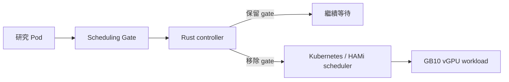
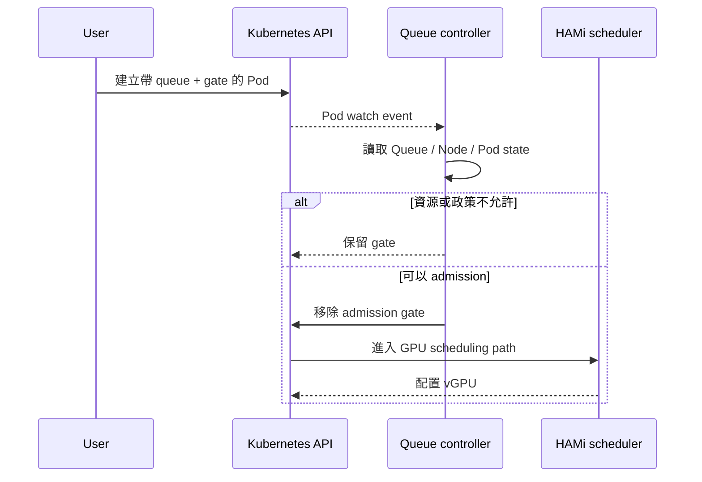

# 00｜先建立全貌

## 一句話

本專案不是重寫 GPU scheduler，而是在 Kubernetes scheduler 之前加入 queue-aware admission。

## 四個名詞分工

| 名詞 | 它是什麼 | 它不做什麼 |
|---|---|---|
| `VGPUQueue` | queue policy 的資料 | 不直接分配 GPU |
| Scheduling Gate | 暫停 Pod 進入 scheduler 的開關 | 不決定 GPU placement |
| Rust controller | 決定何時移除 gate | 不取代 scheduler |
| HAMi | 實際 vGPU allocation / isolation | 不做 queue fairness |

## 一個 Pod 的生命週期

## 目前已完成

- gx10：k3d + k3s + GB10 GPU path。
- HAMi：`nvidia.com/gpu`、`gpumem`、`gpucores`。
- Rust controller：watch、admission、metrics。
- 一個 `VGPUQueue` CRD。
- queue、fragmentation、adaptive 四種研究 mode。
- Prometheus scrape、smoke test、CSV/JSON experiment output。

## 目前沒有做

- custom kube-scheduler
- admission webhook
- database / Redis / message queue
- HAMi-Core fork
- GPU workload eviction
- 真正修改 HAMi runtime hard limit 的 overcommit
