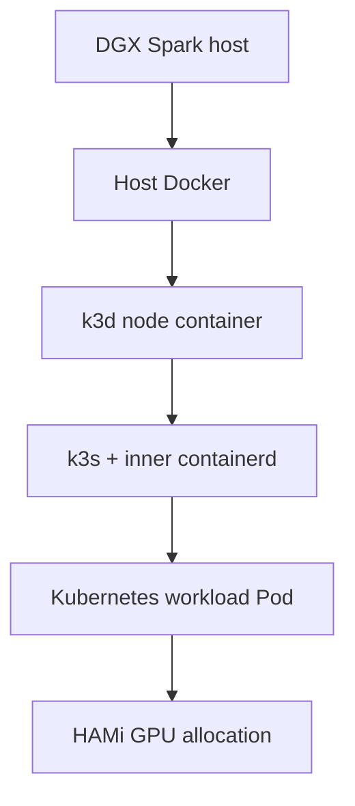

# 01｜平台：k3d、k3s、HAMi、Prometheus

## 先分清楚兩層



Host Docker 的 NVIDIA runtime 只保證 GPU 能進入 k3d node container。`k3d-gpu` image 額外讓 k3s 內層 containerd 知道 NVIDIA runtime。

## 各元件的目的

| 元件 | 目的 |
|---|---|
| Docker | 在 DGX Spark 上啟動 container |
| k3d | 用 Docker container 組出 k3s cluster |
| k3s | Kubernetes API、kubelet、scheduler、containerd |
| HAMi | GPU/vGPU resource registration、allocation、isolation |
| Prometheus | 收集 controller 和 Kubernetes metrics |
| k9s | 本機觀察 Kubernetes 的 CLI，不是 cluster service |

## GPU image 做什麼？

`deploy/k3d-gpu/` 不是 workload image。它包含：

- k3s binary
- NVIDIA Container Toolkit / runtime
- k3s containerd 的 NVIDIA runtime 設定

建立 cluster 時由 `--gpus all` 把 host GPU 傳入 node，再由 image 讓內層 k3s 使用它。

## 可重現的基礎設施步驟

```bash
scripts/build-k3d-gpu-image.sh
scripts/deploy-k3d.sh --create --cluster gx10
scripts/deploy-hami.sh --cluster gx10 --node k3d-gx10-agent-0
scripts/deploy-prometheus.sh --cluster gx10
```

已有 gx10 時不要加 `--create`；`--recreate` 會刪除 cluster，只有確認資料安全後才使用。

## 驗證重點

```bash
kubectl --context k3d-gx10 get nodes
kubectl --context k3d-gx10 get node k3d-gx10-agent-0 \
  -o jsonpath='{.status.allocatable.nvidia\.com/gpu}'
kubectl --context k3d-gx10 -n kube-system get pods
```

預期：node `Ready`、HAMi components `Running`、GPU resource 為 `10`。
