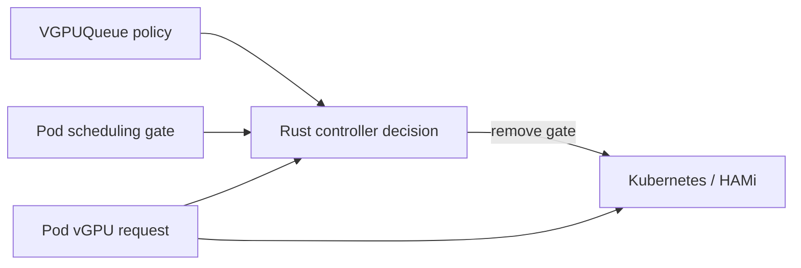
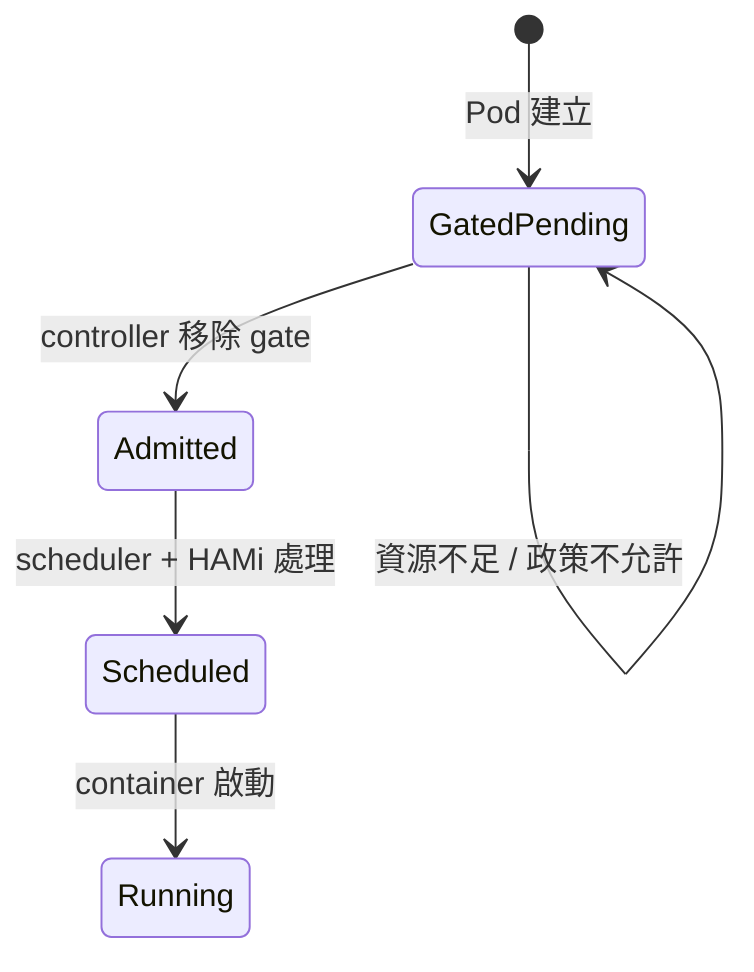

# 02｜Gate、Queue、vGPU request 如何合作

這三者不是同一個東西。



## Pod 的三個欄位

```yaml
metadata:
  annotations:
    queue-aware-vgpu.io/queue: interactive
spec:
  schedulingGates:
    - name: queue-aware-vgpu.io/admission
  containers:
    - resources:
        limits:
          nvidia.com/gpu: "1"
          nvidia.com/gpumem: "8192"
          nvidia.com/gpucores: "20"
```

| 欄位 | 問題 |
|---|---|
| queue annotation | 這個 workload 屬於哪一隊？ |
| scheduling gate | 現在先不要交給 scheduler 嗎？ |
| vGPU request | 之後需要多少 GPU 資源？ |

## 實際生命週期



Gate 只是「暫停開關」。controller 不會替 Pod 分配 GPU；gate 移除後，才輪到 Kubernetes 和 HAMi。

## `VGPUQueue` 的角色

它保存 controller 做決策需要的政策：

- `weight`：公平性權重
- `maxRunning`：同時執行數上限
- `maxMemoryMiB`：queue memory budget
- `priority`：額外優先級欄位
- `overcommit`：logical admission 上限
