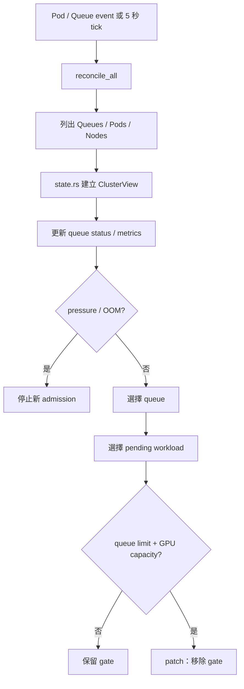

# 03｜Controller 一次如何做決策

controller 的核心不是「啟動 Pod」，而是「決定要不要移除 gate」。



## 用白話描述

每次 reconcile，controller 會問：

1. 現在有哪些 queue？
2. 每個 queue 有多少 pending / running workload？
3. Node 目前有多少 GPU capacity？
4. 系統是否有 OOM、memory pressure、abnormal restart？
5. 下一個應該給哪個 queue？
6. 這個 workload 放得下嗎？
7. 可以的話，只移除 `queue-aware-vgpu.io/admission`。

## 重要分工

```text
state.rs
→ 把 Kubernetes object 翻譯成 ClusterView

policy/
→ 決定 queue / candidate / overcommit

controller.rs
→ 組合決策並 patch Pod

HAMi
→ gate 移除後處理真實 GPU allocation
```

## 程式閱讀入口

- [controller.rs](https://github.com/Grasonyang/queue-aware-vgpu/blob/main/src/controller.rs)：`run()`、`reconcile_all()`
- [state.rs](https://github.com/Grasonyang/queue-aware-vgpu/blob/main/src/state.rs)：`ClusterView::from_objects()`
- [queue.rs](https://github.com/Grasonyang/queue-aware-vgpu/blob/main/src/policy/queue.rs)：`choose_queue()`
- [fragmentation.rs](https://github.com/Grasonyang/queue-aware-vgpu/blob/main/src/policy/fragmentation.rs)：`choose_best_fit()`
- [overcommit.rs](https://github.com/Grasonyang/queue-aware-vgpu/blob/main/src/policy/overcommit.rs)：`decide()`
