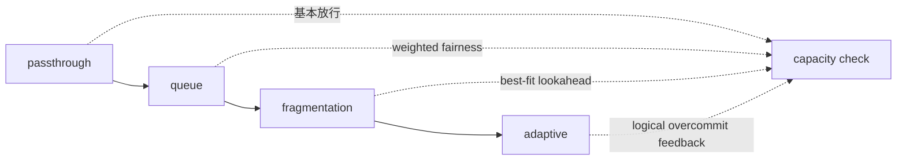

# 04｜四種 mode

四種 mode 共享同一條 controller pipeline，只切換 policy stage。



| Mode | 啟用的功能 | 目前意義 |
|---|---|---|
| `passthrough` | 基本 queue / FIFO / capacity path | ablation baseline |
| `queue` | weighted fairness、starvation protection | 研究主功能起點 |
| `fragmentation` | queue + bounded lookahead + best-fit | 減少 stranded capacity |
| `adaptive` | fragmentation + Prometheus feedback | 測試 conservative overcommit |

## 重要的實作限制

- 目前四種 mode 都透過同一個 controller pipeline。
- `passthrough` 仍使用 queue annotation；它不是完全繞過 controller 的純 Kubernetes + HAMi baseline。
- `adaptive` 只調整 logical admission ratio。
- HAMi runtime hard limit 沒有被 controller 動態修改。
- ratio 預設在 `1.0` 到 `1.2`，每次步進 `0.05`，cooldown `45` 秒。

## 切換 mode

```bash
scripts/run-experiment.sh --cluster gx10 --mode queue
scripts/run-experiment.sh --cluster gx10 --mode fragmentation
scripts/run-experiment.sh --cluster gx10 --mode adaptive \
  --prometheus-url http://monitoring-kube-prometheus-prometheus.monitoring.svc:9090
```

實驗腳本會更新 ConfigMap 並重啟 controller；實驗後重新執行 `scripts/deploy-controller.sh --cluster gx10`，恢復正式設定。
