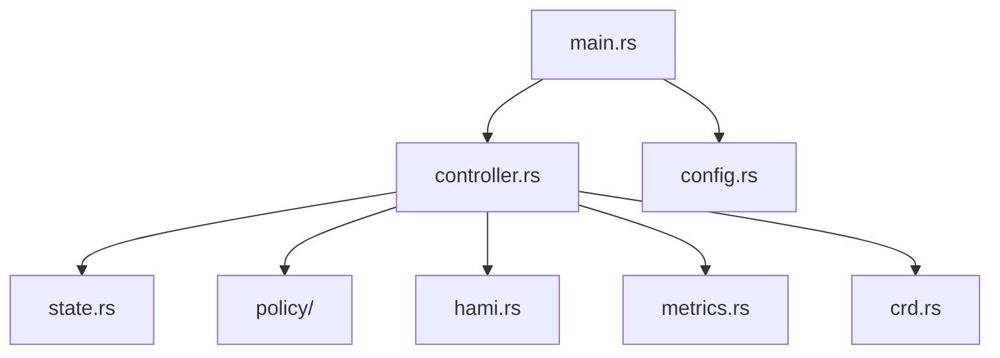

# 05｜概念如何對應到 `src/`

先用責任分層，不要從 Rust 語法開始。



| 檔案 | 只回答一個問題 |
|---|---|
| `lib.rs` | 哪些 module 對外公開？ |
| `main.rs` | 程式如何啟動？ |
| `config.rs` | system 設定從哪裡來？ |
| `crd.rs` | `VGPUQueue` 長什麼樣？ |
| `state.rs` | 目前 cluster 狀態是什麼？ |
| `controller.rs` | 現在是否移除 gate？ |
| `hami.rs` | HAMi object 如何解析？ |
| `policy/` | queue / candidate / ratio 如何選？ |
| `metrics.rs` | 如何讓 Prometheus 觀察？ |

## 一次 admission 的 code path

```text
main.rs
  → controller::run()
    → reconcile_all()
      → ClusterView::from_objects()
      → choose_queue()
      → choose_best_fit()（部分 mode）
      → remove_admission_gate()
```

## C++ 開發者最小對照

| Rust | 先類比成 C++ |
|---|---|
| `struct` | `struct` / data class |
| `impl Type` | member function 定義區塊 |
| `trait` | interface / concept 的行為契約 |
| `Option<T>` | `std::optional<T>` |
| `Result<T, E>` | `std::expected<T, E>` |
| `pub mod` | 對外公開的 namespace / module |
| `serde` | JSON/YAML mapping framework |
| `BTreeMap` | `std::map` |

先理解資料流，再回頭學 ownership、async、Arc、Mutex。
