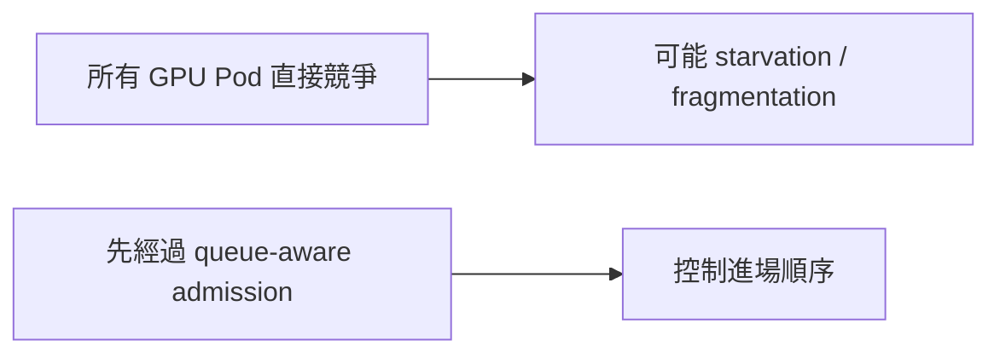

# 08｜明天的 5–7 分鐘報告稿

## 第 1 張：我完成了什麼？

> 我完成了一個 queue-aware vGPU admission prototype。它不取代 Kubernetes scheduler，也不取代 HAMi，而是在 Pod 進入 scheduler 前，用 Scheduling Gate 控制 admission。

## 第 2 張：為什麼需要它？



> 問題不是 HAMi 不會分配 GPU，而是多租戶 workload 何時進入 GPU scheduling path 沒有 queue policy。

## 第 3 張：系統分工

```text
VGPUQueue：描述政策
Scheduling Gate：暫停 Pod
Rust controller：做 admission decision
Kubernetes / HAMi：實際 scheduling 和 allocation
```

## 第 4 張：一個 Pod 的流程

> Pod 建立時帶 queue annotation、GPU request 和 scheduling gate。controller 觀察 queue、node、pod state；可以執行時只移除 gate，之後由 Kubernetes 和 HAMi 接手。

## 第 5 張：四種 mode

```text
passthrough → queue fairness → fragmentation best-fit → adaptive feedback
```

> 四種 mode 共用同一 pipeline，只逐步開啟不同 policy stage。

## 第 6 張：我如何驗證？

```text
CRD 建立
→ Pod 保持 gated Pending
→ controller 移除 gate
→ HAMi allocation
→ nvidia-smi 成功
→ Prometheus scrape 成功
```

目前 smoke test 和 burst workload 已在 gx10 實際通過。

## 第 7 張：限制與下一步

> 目前 adaptive 只做 logical admission overcommit，還沒有修改 HAMi runtime hard limit；下一步是重複 ablation experiment，計算 mean/P95 wait、throughput、fairness、OOM 和 restart rate。

## 老師可能問的三題

**這是不是自己寫 scheduler？**

不是；controller 只移除 gate，scheduler 和 HAMi 仍負責後續工作。

**VGPUQueue 是 GPU partition 嗎？**

不是；它是 controller 的 policy bucket，保存 weight、limit 和 status。

**adaptive 有真的改變 GPU 硬限制嗎？**

目前沒有；它只改 admission 計算，這個限制已被明確保留。
