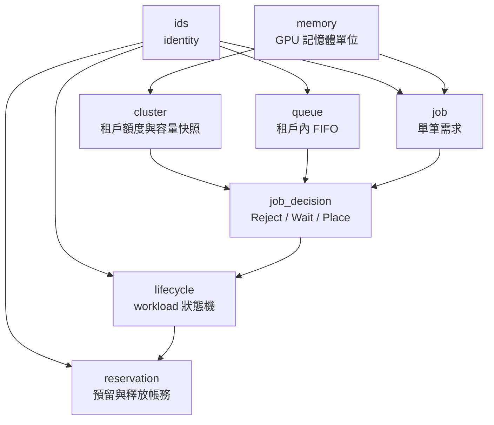

# V1 Domain 工具地圖

本目錄把 `src/domain` 的每個 module 拆開說明，方便 wiki 逐頁閱讀。
這些不是 Kubernetes controller，也不是 HAMi 的替代品；它們是 Rust 內部的
Kubernetes-independent policy 與狀態契約。

## 閱讀順序

1. 先看 `ids` 與 `memory`，理解所有輸入的語意。
2. 再看 `cluster`、`queue`、`job`，理解排程前的資料。
3. 看 `decision`，確認何時拒絕、等待或產生放置意圖。
4. 最後看 `lifecycle` 與 `reservation`，理解執行與資源收尾。

## 共同邊界

Domain module 只接收已正規化的資料，回傳 decision、reason 或 state transition。
Kubernetes、HAMi、Prometheus 的 object 與 API 呼叫留在 adapter/application 層。
