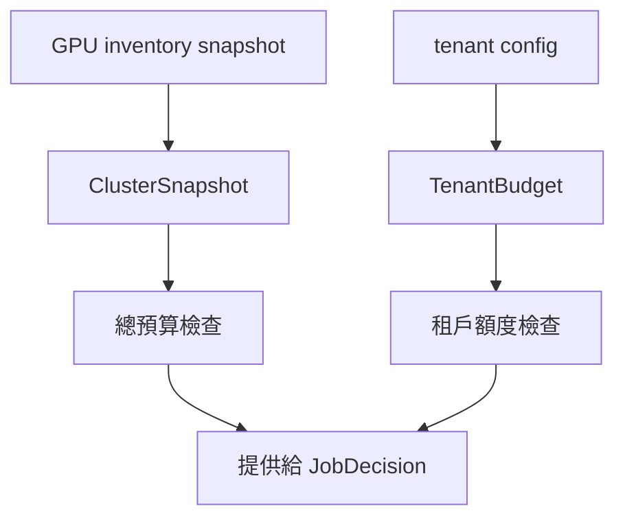

# Cluster 治理：`cluster`

## 用處

`ClusterSnapshot` 描述目前邏輯 GPU 預算與已預留量；`TenantBudget` 描述單一租戶的額度與已用額度。
它們回答「現在總容量與租戶額度是否放得下」這個問題。

## 架構地位

這是 Cluster 層的資料與 invariant，不決定 Queue 內順序、不建立 Pod，也不執行 GPU placement。
未來加權輪詢／DQA 會使用這些 snapshot，但不應把 scoring 塞進容量 value object。

Review 時確認：quota 不能被其他租戶偷偷借用；`reserved` 必須計入可用量；snapshot 只是評估時點，不是假裝即時鎖。
