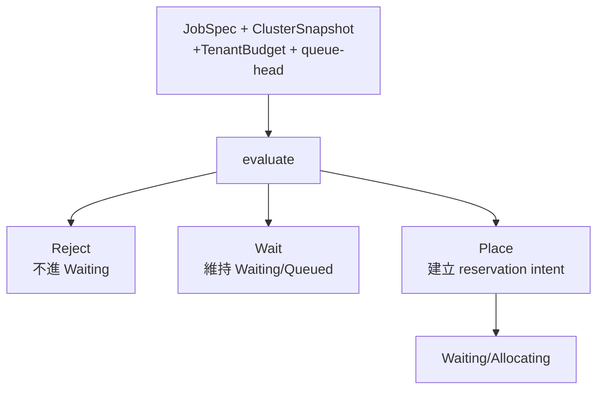

# 排程決策：`job_decision`

## 用處

`JobSpec::evaluate` 將 snapshot、額度、Queue 順序與需求轉成三種明確結果：

- `Reject`：需求本身不合法或超過總預算。
- `Wait`：需求合法，但目前沒有調度機會、額度或容量。
- `Place`：目前可行，產生一次 reservation／placement intent。

## 架構地位

它是純函式式的決策邊界，不做 I/O、不建立 reservation、不建立 Pod。application/controller 依結果執行外部動作。

Review 時依序檢查：總預算、租戶是否匹配、是否為隊首、租戶額度、當下容量；每個失敗原因都應可觀測且可測試。
