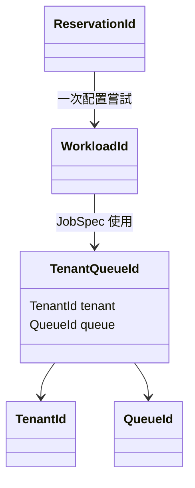

# Identity：`ids`

## 用處

`ids` 用 newtype 表示租戶、Queue、workload 與 reservation 的 identity，避免把
任意 `String` 誤當成另一種 ID。

## 架構地位

它是所有 domain module 共用的最底層語意，不做排程、不保存狀態，也不呼叫外部系統。
`TenantQueueId` 將租戶與 Queue 綁成一個不可分離的 ownership identity。

Review 時確認：ID 建立時驗證格式；同一 workload 在 reconcile 中維持不變；手動重跑才建立新 ID。
