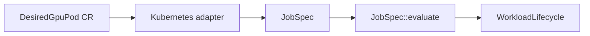

# 單筆需求：`job`

## 用處

`JobSpec` 是一次 GPU 工作需求的最小 domain representation，包含 workload identity、租戶 Queue、
GPU 記憶體需求與等待模式。

## 架構地位

它不是 Kubernetes Pod spec，也不是 CRD schema。未來 `DesiredGpuPod` adapter 將外部 CR 轉成 `JobSpec`；
JobSpec 不直接建立 Pod 或執行工作。

Review 時確認：tenant 與 queue 使用同一 `TenantQueueId`；需求超過總預算在 lifecycle 前拒絕；合法但暫時不足只能等待。
