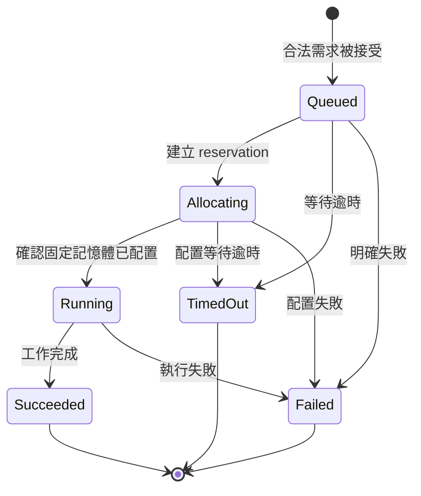

# Workload 生命週期：`lifecycle`

## 用處

`WorkloadLifecycle` 追蹤一次已接受 workload 從等待、配置、執行到終止的狀態。
對外主狀態是 `Waiting`、`Running`、`Succeeded`、`Failed`、`TimedOut`；Waiting 內部分為 Queued 與 Allocating。

## Review 邊界

- `Running` 必須有固定 GPU 記憶體配置證據，Pod phase `Running` 單獨不足。
- `Forever` 不會逾時；`Timeout` 從 accepted time 起算，reconcile 不重設。
- terminal 狀態不可回到 Waiting，也不自動 retry。
- lifecycle 不知道 Kubernetes、HAMi 或 Prometheus；那些是 adapter 的責任。
