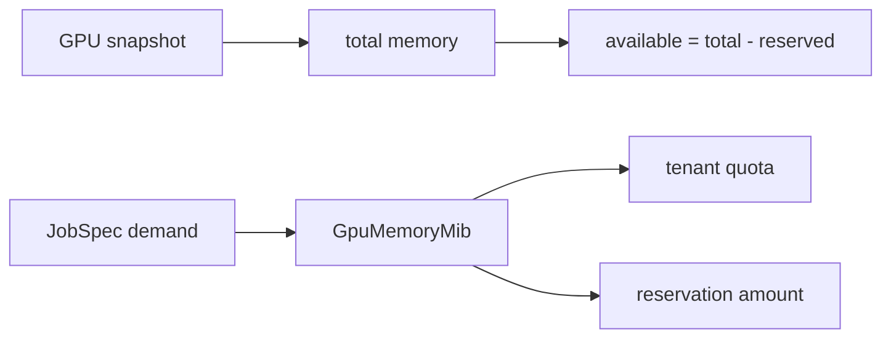

# GPU 記憶體單位：`memory`

## 用處

`GpuMemoryMib` 封裝 GPU 記憶體數值與加減運算，讓需求、額度、預留量使用同一個明確單位。

## 架構地位

它是容量計算的 value object，不代表實體 GPU，也不負責讀取 GB10 或 HAMi 的實際數據。
V1 的 `96` 是可設定的邏輯實驗預算；GB／GiB 的轉換必須在 adapter 契約中明訂。

Review 時確認：零值、溢位、總量小於已預留量，以及預留量不可被重複算成可用容量。
