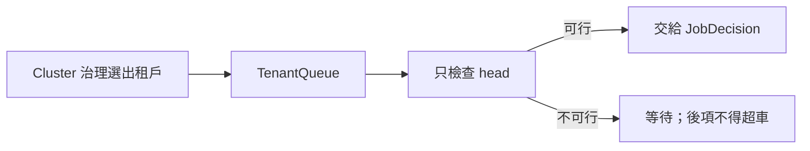

# 租戶 Queue：`queue`

## 用處

`TenantQueue` 保存同一 `TenantQueueId` 下的 workload 順序，提供 enqueue、head 與嚴格 FIFO 的 pop。

## 架構地位

它是 Job 層的順序邊界。Cluster 層決定哪個租戶取得機會；Queue 只決定該租戶的哪一筆先處理。
隊首暫時放不下時，後續 workload 不得超車，但不阻塞其他租戶。

Review 時確認：跨租戶 Queue 的 workload 不能 enqueue；重複 enqueue 被拒絕；pop 非隊首被拒絕。
