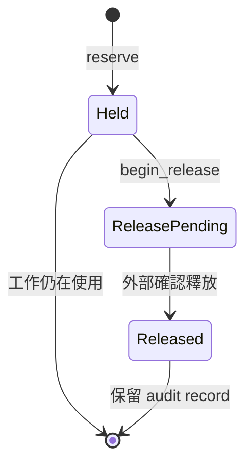

# 資源預留與釋放：`reservation`

## 用處

`ReservationLedger` 記錄一次 workload 對 GPU 記憶體的承諾，防止多個調度決策同時使用同一容量。
它不是實際 VRAM 使用量，而是「這段容量已不能再分配」的帳務。

## 生命週期

`WorkloadLifecycle` 在 terminal 後把資源標成 `Pending`，先取得 `ReleasePermit`，再由 ledger 等待外部確認。
這避免 UI 顯示失敗或 Pod 結束事件尚未同步時，容量被過早歸還。

Review 時確認：同一 reservation 不可重複建立；釋放最多計算一次；錯誤的 reservation identity 不可確認；
帳務永遠不會因重複 reconcile 而變成負值或重複增加。
