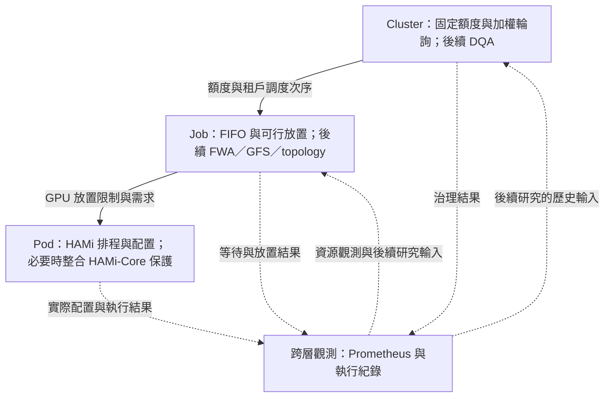
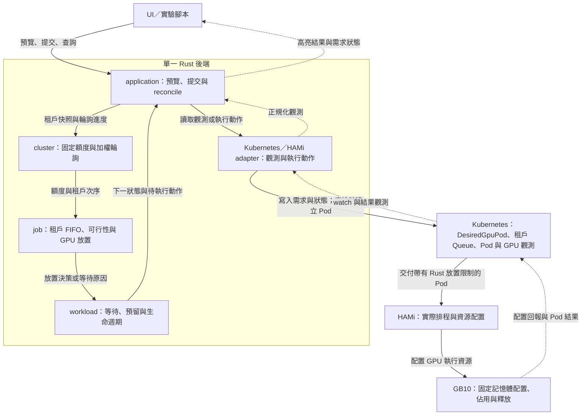
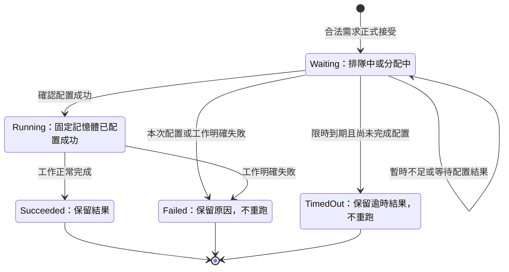
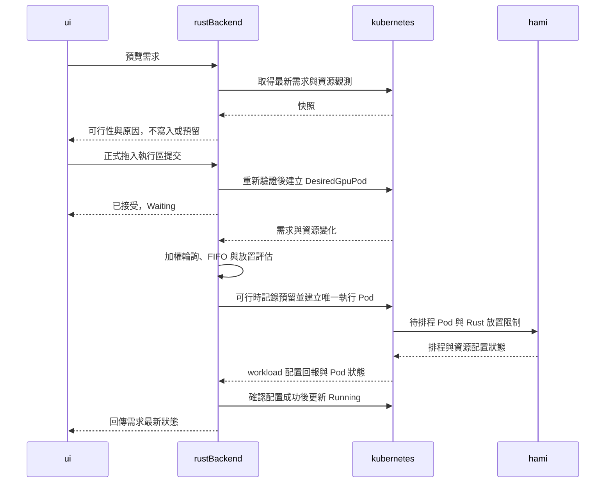

# V1 架構圖

主文件：[@v1.md](v1.md)。本檔只保存 Mermaid 圖與讀圖說明，詳細規則以主文件為準。
以下是目標設計，不是現有部署能力宣告；不引入額外的服務或資料庫。

## 1. 研究全景與第一版範圍

實線表示決策與執行方向，虛線表示觀測回饋。Rust 負責 Cluster 與 Job；
第一版 Pod 層使用既有 HAMi，HAMi-Core 開發僅在後續研究必要時進行。

## 2. MVP 執行流程

圖中的 Rust 節點是同一程序內的 module，不是獨立部署的服務。
箭頭表示資料與決策流，不代表 domain module 直接呼叫 Kubernetes 或 HAMi。

Cluster 治理 queue 決定租戶間的機會；租戶 queue 排列自己的 `DesiredGpuPod`。
兩者不重複保存需求。預覽只取決策結果，正式提交後的 reconcile 才能預留並建立執行 Pod。

## 3. DesiredGpuPod 生命週期

`Waiting` 包含排隊中與分配中；排隊中尚未預留，分配中已預留並追蹤同一次嘗試。
圖只呈現 UI 主狀態，內部分類與資源帳務見主文件。
不合法需求在正式接受前拒絕，不進入本狀態圖。

- 永久等待沒有逾時轉移；限時模式從正式接受起算，重啟或轉入分配中不重設期限。
- `Running` 以 workload 實際配置成功為準，不只是 Pod phase；之後另計固定佔用時間。
- API 結果不明先核對同一次嘗試，不能直接當成失敗或另建一個 Pod。
- 終止不等於立刻釋放額度；必須確認實際工作已停止或不再可能取得該份資源。
- 結束符號表示該次執行結束，不表示刪除 CR。手動重跑建立新 CR，不把終止狀態改回等待。

## 4. UI 預覽與正式提交

本圖只畫合法提交到成功執行的路徑；等待、失敗與逾時分支見上面的生命週期。
`rustBackend` 是前圖整個後端，不是另一個服務；配置與工作結果由後端觀測後更新 CR。

高亮不是資源承諾，提交也不繞過 queue。需求合理但當下不足，仍由 Rust 在 `Waiting` 中安排；
UI 回彈只是顯示行為，不刪除需求或驅逐 Pod。
