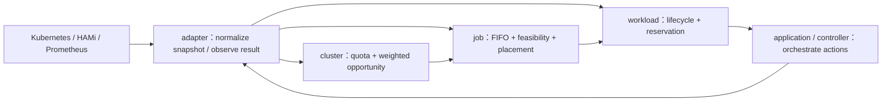
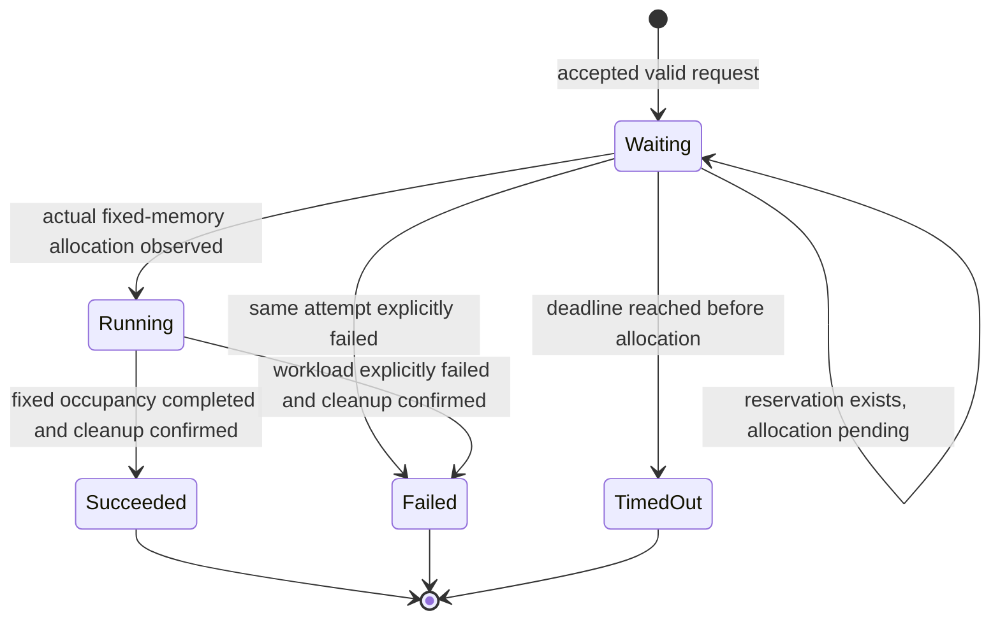

# V1 Domain Contracts and Lifecycle Invariants

這份文件是 GRA-5 的 domain contract。它把 [V1 架構](v1.md) 中已確認的語意整理成
Rust domain module 可以直接實作與測試的邊界；不代表目前 prototype 已經具備這些能力。

- 主要研究層：Cluster；變更類型：`baseline`（domain contract）
- Authority：[研究範圍與邊界](../dev/research-scope-and-boundaries.md)、[V1 架構](v1.md)、研究計畫 `docs/plan/v3.9_0207.docx`
- Kubernetes、HAMi、Prometheus 的 object／response 不得穿過 adapter 邊界進入下列 domain contract。
- 本文件不指定 Kubernetes CRD 的欄位名稱、儲存格式、研究公式或實驗 threshold。

## 1. Boundary

Domain module 只接收最小、可測試的 representation，回傳 decision 或 state transition；
controller 與 adapter 負責 I/O、排序來源、snapshot 建立、status patch 與實際 Pod 動作。

Domain 不得自行呼叫 API、query metrics、patch resource、sleep、retry 或建立 Pod。
Domain output 是可觀察的 decision、reason、next state 與 action intent；adapter 才把
action intent 轉成外部動作。

## 2. Shared value semantics

以下是跨 module 的語意，不要求一對一對應 Rust struct 名稱；實作必須用 enum、newtype
或受驗證的 struct，避免以散落的 `String`、`bool` 和 magic number 代表同一個概念。

| 概念 | 必須保留的語意 |
| --- | --- |
| `TenantQueueId` | 將租戶與其 queue 綁定成單一 identity；不能讓 Job 持有未關聯的 tenant／queue 組合。 |
| workload identity | 一次 `DesiredGpuPod` 嘗試的穩定 identity；reconcile 不產生新 identity。 |
| `MemoryAmount` | 明確攜帶單位；GB 與 GiB 不可隱式互換。96 GB 是可設定的實驗預算，不是物理切割保證。 |
| `WaitPolicy` | `Forever` 或帶固定 deadline 的限時等待；deadline 起點是正式接受時間。 |
| reservation identity | 一次分配嘗試的唯一 reservation；重複 reconcile 必須重用它。 |
| decision reason | 可記錄、可測試的原因分類；不能只回傳無法判斷的 `false`。 |

## 3. Cluster contract

`cluster` 只處理租戶間治理，不處理 GPU placement 或 Kubernetes object。

### Input

- 租戶 queue snapshot：`TenantId`、固定 quota、weight、目前已預留／占用量。
- 可用候選與是否有租戶隊首需求的最小摘要。
- weighted-round-robin progress；progress 不能在每次 reconcile 重設。

### Output

治理 decision 必須能表示：

- 選出的租戶與下一個 progress；或
- 此輪跳過的原因（無候選、額度不足、隊首暫時無法放置），並允許繼續檢查其他租戶。

第一版是加權輪詢 baseline：weight `2:1` 只代表調度機會比例，不代表記憶體用量、
GPU 時間或 quota 變成 `2:1`。歷史行為影響的 DQA 不在 GRA-5 自行發明。

### Invariants

1. 不同租戶間的機會由 cluster decision 決定；job module 不得自行改 quota 或 weight。
2. 額度不足不能被當成成功的治理 decision，也不能隱式借用另一租戶的閒置額度。
3. 一次 reconcile 只能消費／產生一個明確的 progress transition；重跑同一 snapshot 不得把 progress 重設成初始值。
4. Cluster module 不保存第二份 workload 清單；需求 identity 由 Kubernetes 的 `DesiredGpuPod` 保存。

## 4. Job contract

`job` 處理單一租戶內的需求順序、當下可行性與 GPU placement；它不建立 Pod，也不直接
讀 Kubernetes 或 HAMi object。

### Input

- 已由 cluster 決定的租戶 quota、調度次序與 tenant queue snapshot。
- 租戶隊列中按提交順序排列的需求摘要；每筆包含 GPU memory demand、固定佔用時間、
  `WaitPolicy` 與 workload identity。
- GPU inventory snapshot：邏輯實驗預算、已預留量、實際占用量與可用 placement candidate。

### Output

對隊首需求產生且只能產生下列三類結果：

| 結果 | 語意 | 後續 lifecycle |
| --- | --- | --- |
| `Reject` | 需求本身不合法或超過允許的總預算；不是暫時資源不足。 | 不進入 `Waiting`，不建立執行 Pod。 |
| `Wait` | 需求合法，但目前 quota、GPU 空間或調度機會不足。 | 正式接受後維持 `Waiting`，交由 Rust 後續安排。 |
| `Place` | 在此 snapshot 下可配置，且產生明確 placement 與 reservation intent。 | 進入 `Waiting` 的分配中分類；等待實際配置證據。 |

同一租戶嚴格 FIFO：隊首暫時放不下時，後續需求不得超車；其他租戶仍可由 cluster
round-robin 繼續取得機會。可行性預覽是唯讀 decision，不建立 reservation、CR 或 Pod。

### Invariants

1. `Reject` 與 `Wait` 必須可由 reason 區分；暫時不可行不得被轉成永久失敗。
2. `Place` 的 reservation intent 不得超出 cluster 交付的 quota 或 inventory snapshot。
3. 一筆 workload identity 在同一嘗試中只能有一個 active placement／reservation。
4. Job module 回傳 placement decision，不回傳 Kubernetes Pod、HAMi annotation 或 Prometheus response。

## 5. Workload lifecycle contract

對外主狀態固定為 `Waiting`、`Running`、`Succeeded`、`Failed`、`TimedOut`。
`Waiting` 內部可區分 `Queued` 與 `Allocating`，但不新增對外的 `Starting` 主狀態。

### Transition rules

| Transition | Required evidence / action |
| --- | --- |
| submit → `Waiting` | 需求已通過正式提交驗證；超預算或不合法需求在此之前被拒絕。記錄 accepted time。 |
| `Waiting:Queued` → `Waiting:Allocating` | job 回傳 `Place`，建立／重用同一次嘗試的 reservation identity。 |
| `Waiting` → `Running` | workload 回報固定 GPU memory 已實際配置；Pod phase `Running` 單獨不足以觸發轉移。 |
| `Waiting` → `Failed` | 本次配置或工作有明確失敗證據；未知結果先核對同一次嘗試。 |
| `Waiting` → `TimedOut` | 限時模式的固定 deadline 已到，且尚未確認配置成功。永久等待沒有此轉移。 |
| `Running` → terminal | 固定佔用完成或工作明確失敗，並確認實際資源不再占用或可取得。 |

### Lifecycle invariants

1. 合法但當下不足的需求進入 `Waiting`；不因一次 `Wait` decision 自動建立新 Pod 或自行重試成另一筆需求。
2. `Waiting:Queued` 尚未預留；`Waiting:Allocating` 已有且只有一份 active reservation。
3. reservation amount 必須計入 quota／budget；預留量不能被當成可再次分配的 free amount。
4. reservation 只能釋放一次，且必須在確認實際 workload 不再占用、也不再可能取得該資源後釋放。
5. `Running` 只代表實際配置已確認；固定佔用時間與等待期限是兩個不同的時間語意。
6. accepted time、waiting deadline、reservation identity 與 attempt identity 在 reconcile 或 controller restart 後不重設。
7. 同一 workload identity 與 attempt 反覆 reconcile 必須是 idempotent：不重複建立 Pod、不重複預留、不重複釋放。
8. `Succeeded`、`Failed`、`TimedOut` 都是 terminal；不自動回到 `Waiting`，也不自動重跑。
9. terminal result 必須保留 reason、時間、reservation／release outcome 與對應 Pod identity（若曾建立）。
10. 管理者手動重跑必須建立新的 workload identity；舊 terminal record 不被覆寫。

## 6. Acceptance matrix for GRA-5

這些是 domain unit tests 應能在無 cluster 的情境下驗證的 observable cases；不是 Kubernetes
smoke test，也不宣稱目前 prototype 已通過。

| Case | Given | Expected |
| --- | --- | --- |
| over-budget | demand 超過允許總預算 | `Reject`；沒有 `Waiting`、reservation 或 execution Pod intent。 |
| temporarily unavailable | demand 合法但目前無足夠 GPU／quota | `Wait`；需求維持 `Waiting:Queued`；不超過 tenant FIFO。 |
| placed once | 隊首可行且 cluster 交付機會 | 一個 `Place` 與一個 reservation intent；重複評估不增加數量。 |
| allocation observed | 同一 reservation 收到實際固定 memory 配置證據 | `Waiting` → `Running`；只看 Pod phase 不足。 |
| explicit failure | 同一次嘗試明確失敗 | `Failed`；保留原因與收尾結果；不自動重跑。 |
| deadline | `WaitPolicy::Until` 到期且未配置成功 | `TimedOut`；deadline 不因 reconcile／restart 延後；不自動重跑。 |
| unknown result | 外部回報不完整或 API 結果不明 | 追蹤同一次嘗試並核對；不可直接當成 failure 或建立第二個 Pod。 |
| release once | terminal cleanup 被重複觀測 | reservation 最多釋放一次；帳務不會變成負值或被重複歸還。 |
| manual rerun | 管理者拖動已結束卡片重跑 | 新 workload identity；舊 terminal record 保留。 |

## 7. Deliberately open

以下內容不在 GRA-5 自行決定，實作遇到時應回報 Lead／另開 issue：

- CRD `spec`／`status` 的正式欄位名稱、versioning 與 Kubernetes condition schema。
- GB 或 GiB 的儲存單位選擇；文件只要求不能隱式轉換。
- 多 GPU placement 的 topology／FWA／GFS scoring 與任何 threshold。
- DQA 歷史訊號、信用公式、動態 quota 調整規則。
- HAMi annotation、device-plugin 表示法與固定記憶體 workload 的實機證據格式。
- 是否需要以既有 Kubernetes status 保存 weighted-round-robin progress；不得新增第二個 persistent state store，除非另有研究設計依據。
